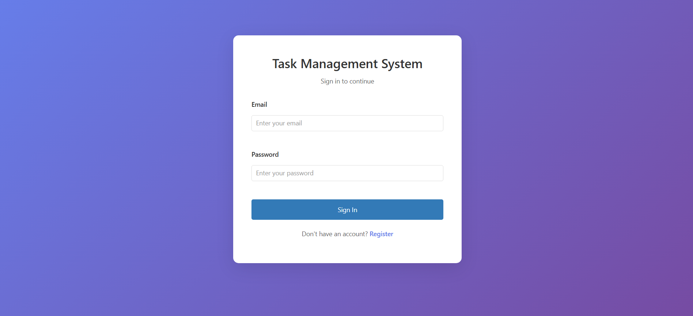
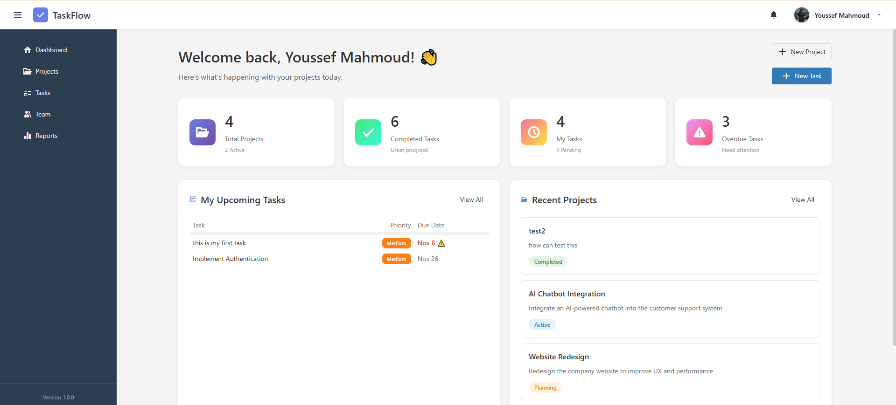
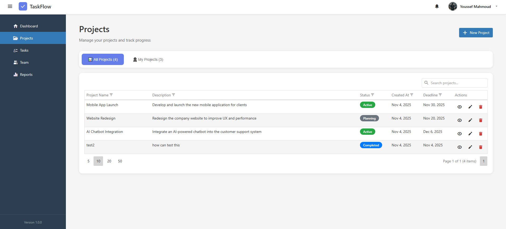
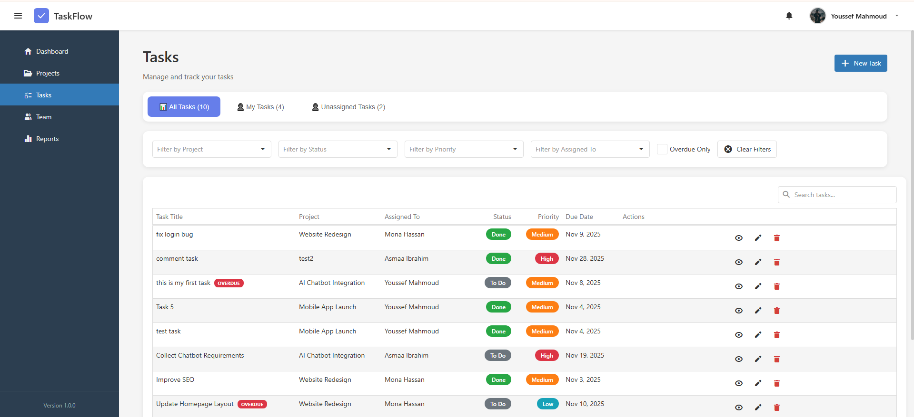
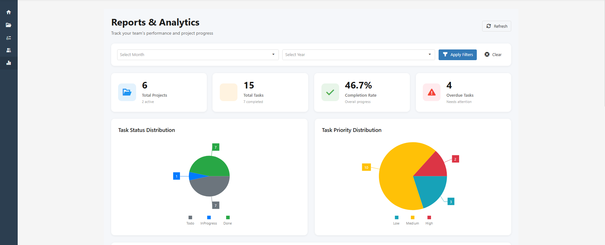
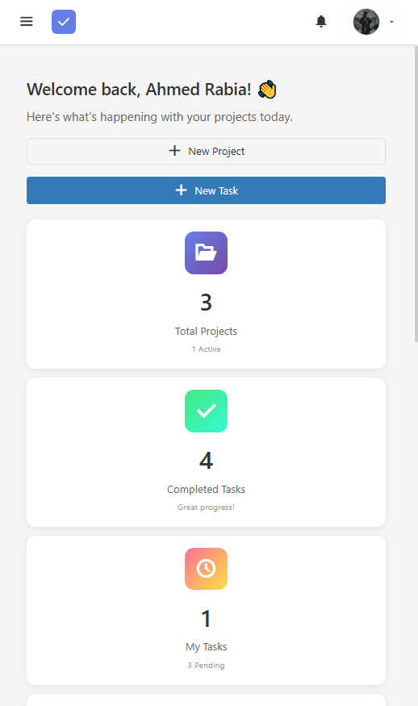

# 🗂️ Task Management System

## 📖 Overview

**Task Management System** is a full-stack web application that allows teams to manage projects and tasks efficiently.  
Each project can have multiple tasks, and users can easily create, edit, and manage them.  
Every task supports **comments, file attachments, and real-time updates**, providing a seamless team collaboration experience.  
The system also includes an **interactive dashboard** and **reporting page** with analytical charts for better project insights.

---

## 🚀 Features

- 🔐 **User Authentication & Authorization** (JWT-based)
- 🗃️ **Project & Task Management** (Create, Edit, Delete)
- 💬 **Comments & File Attachments** for each task
- 🔔 **Real-time Notifications** using SignalR
- 📊 **Dashboard & Reports** with data visualization
- 🧩 **Swagger API Documentation**
- 🏗️ **Clean Architecture / Layered Design**

---

## 🛠️ Tech Stack

### **Frontend**

- 🔼 React
- 🧠 Redux
- 🌐 Axios
- 📊 DevExtreme Components

### **Backend**

- 🔷 ASP.NET Core
- 🗄️ SQL Server

### **Tools**

- 🧾 Swagger (API Documentation)
- 🧰 Git & GitHub (Version Control)

---

## ⚙️ Architecture Highlights

- **Authentication:** JWT-based system for secure login and access.
- **Real-time Communication:** SignalR for instant updates and notifications.
- **File Upload System:** Manage images and documents for each project/task.
- **Clean Architecture:** Well-structured layers for scalability and maintainability.
- **RESTful API:** Built and documented using Swagger.

---

## 📈 Dashboard & Reports

- Visual analytics for:
  - Project progress
  - Task distribution
  - Team performance
- Interactive charts built with **DevExtreme**.

---

## 📷 Preview / Screenshots

## 🌐 Live Demo 

## ⚡ Live Demo

Check it out here: [Task Management System](https://task-management-livid-theta.vercel.app/)

## 🔮 Future Improvements

- Add user roles & permissions management page.

- Implement task deadline reminders.

- Enhance report filters and export to PDF/Excel.

- Add dark mode UI option.

## ⭐ If you like this project, don’t forget to give it a star on GitHub!
